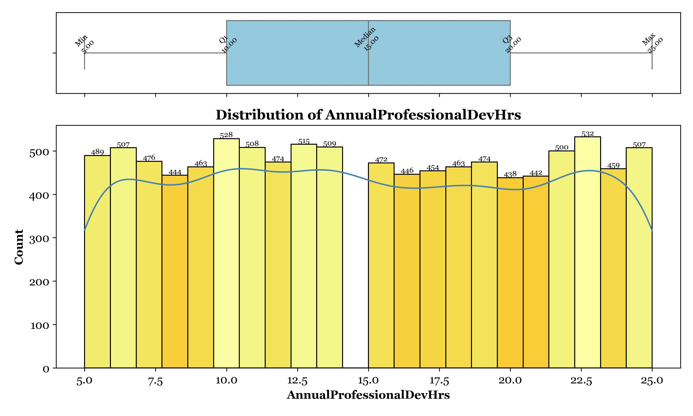
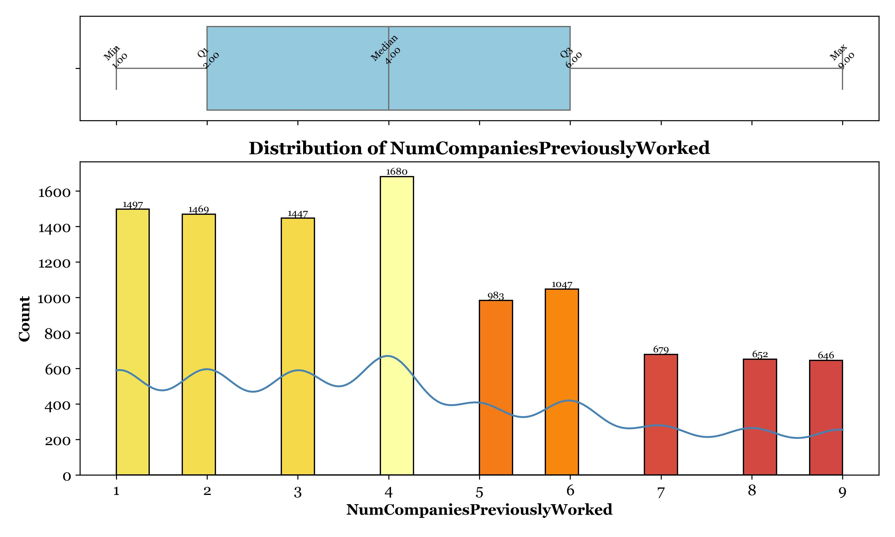
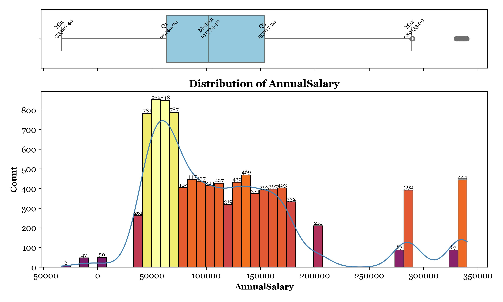
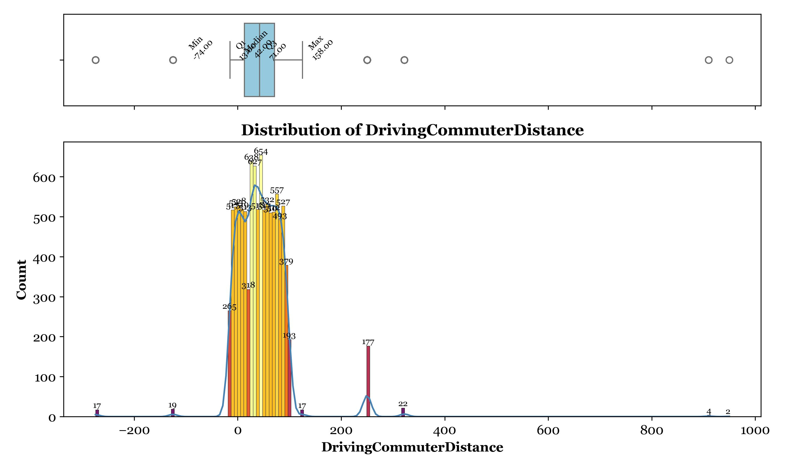
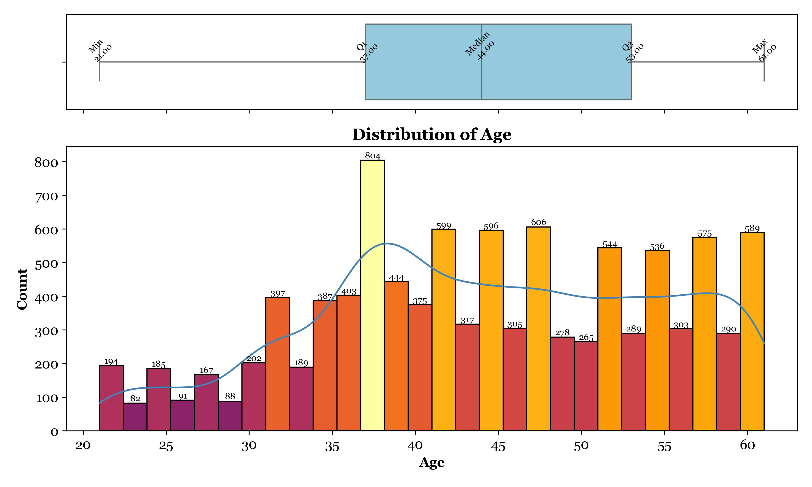
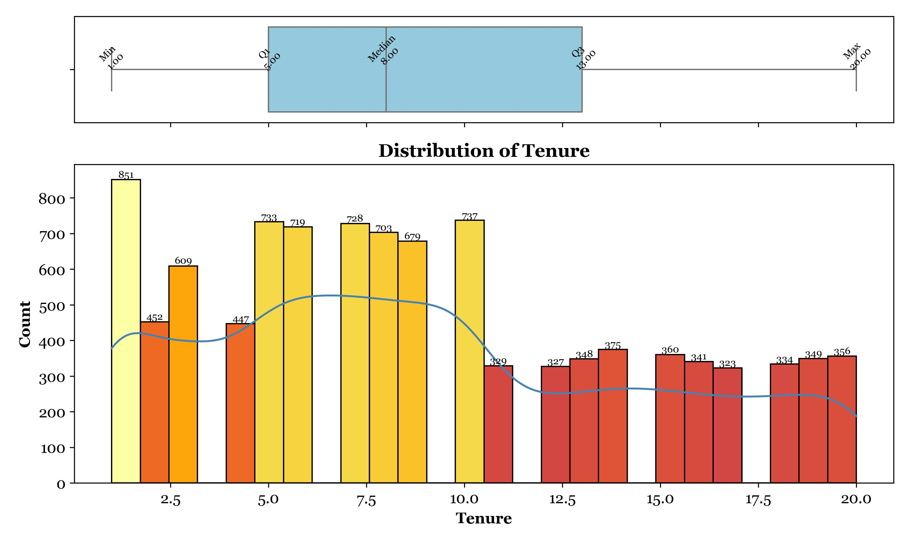
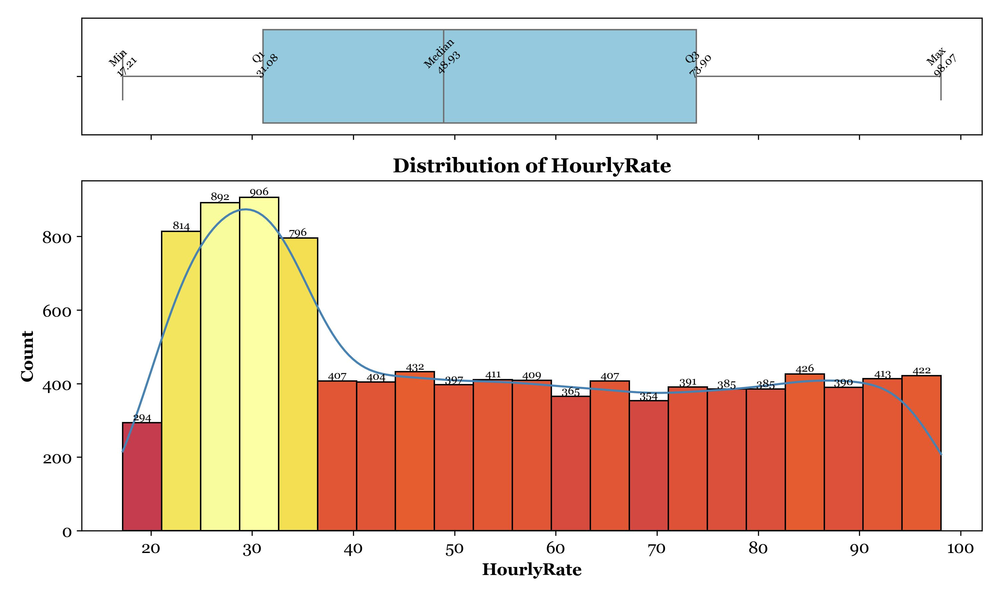
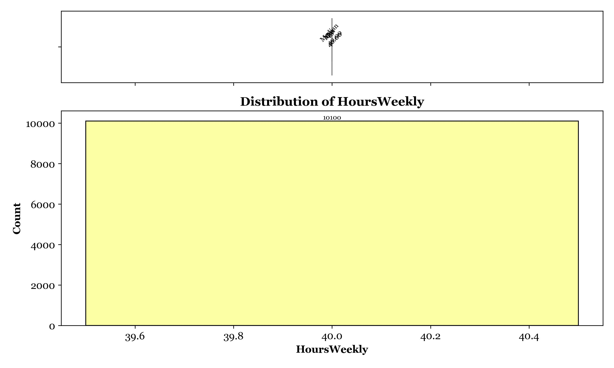

# Employee Turnover — Data Profiling & Cleaning

A production-ready data cleaning pipeline applied to an employee turnover dataset of **10,199 records across 16 variables**. The goal is to prepare a reliable, analysis-ready dataset by systematically identifying and resolving data quality issues — with every decision grounded in statistical reasoning rather than default choices.

> **Note on Data Availability**
> The raw and cleaned datasets have been removed from this repository for data ethics reasons. All generated visualizations are retained in the `Figures/` folder for reference and presentation purposes.

---

## Dataset Overview

| Variable | Data Type | Subtype |
|---|---|---|
| `EmployeeNumber` | Categorical | Nominal (identifier) |
| `Age` | Numeric | Continuous (Ratio) |
| `Tenure` | Numeric | Discrete (Ratio) |
| `Turnover` | Categorical | Nominal (Binary — target) |
| `HourlyRate` | Numeric | Continuous (Ratio) |
| `HoursWeekly` | Numeric | Continuous (Ratio) |
| `CompensationType` | Categorical | Nominal |
| `AnnualSalary` | Numeric | Continuous (Ratio) |
| `DrivingCommuterDistance` | Numeric | Discrete (Ratio) |
| `JobRoleArea` | Categorical | Nominal |
| `Gender` | Categorical | Nominal |
| `MaritalStatus` | Categorical | Nominal |
| `NumberOfCompaniesWorked` | Numeric | Discrete (Ratio) |
| `AnnualProfessionalDevelopmentHours` | Numeric | Continuous (Ratio) |
| `PaycheckMethod` | Categorical | Nominal |
| `TextMessageOptIn` | Categorical | Nominal |

---

## Cleaning Pipeline

### 1. Duplicate Removal

**What:** Checked for duplicate records using `EmployeeNumber` as the unique identifier. Identified and removed **99 duplicate rows**.

**Why this approach:** Employee IDs are surrogate keys — duplication in this column is unambiguous. Using `pandas.drop_duplicates()` on this field is more reliable than row-level comparison, which can miss near-duplicates or flag legitimate repeated measurements.

**Tradeoff acknowledged:** If records were intended to capture change over time (e.g., role updates), dropping duplicates could erase temporal signals. In this dataset's context — a single snapshot of current employment status — deduplication was the correct call.

---

### 2. Missing Value Imputation

Not all missing values are equal. Each column received its own imputation strategy based on distribution shape and the nature of the missingness — not a blanket fill.

#### `AnnualProfessionalDevelopmentHours` → Random Sampling

| Before | After |
|---|---|
|  |  |

**Decision rationale:** The original distribution was approximately **uniform (flat)**. Imputing with the median — the most common default — introduced a sharp artificial spike at that value, distorting the distribution. Random sampling from observed values preserves the natural spread. For algorithms sensitive to distributional shape (k-NN, clustering), this matters.

**Tradeoff:** Without a fixed seed, results are non-reproducible across runs. For final production use, a seed should be set explicitly.

---

#### `NumberOfCompaniesWorked` → Median Imputation

| Before | After |
|---|---|
|  |  |

**Decision rationale:** This column is right-skewed — some employees have worked at an unusually high number of companies. The **median is robust to such outliers**; the mean would be pulled upward by extreme values, creating a biased central estimate. The volume of missing values here was small enough that median imputation did not create visible distribution artifacts.

---

#### `TextMessageOptIn` → New `"Unknown"` Category

**Decision rationale:** Missingness in an opt-in column is itself informative — an employee who didn't respond is behaviorally different from one who said "Yes" or "No." Filling with the mode would erase that signal. Creating an `"Unknown"` category **preserves missingness as a feature**, which can carry predictive value in downstream modeling.

**Tradeoff:** Some algorithms will treat `"Unknown"` as a valid category equal to other values. Care is needed in encoding to ensure models interpret it correctly.

---

### 3. Inconsistent Entries

#### `HourlyRate` — Type Conversion

Values were stored as strings (e.g., `"$24.37"`). Stripped the `$` symbol and cast to `float64`. This is not cosmetic — string-typed numeric columns silently fail in any arithmetic, statistical, or ML operation.

#### `JobRoleArea` — Canonical Standardization

The same roles appeared in multiple formats: `"Information Technology"`, `"InformationTechnology"`, `"Information_Technology"`. Standardized to **8 canonical values**:

`Research` · `Information_Technology` · `Sales` · `Human_Resources` · `Laboratory` · `Manufacturing` · `Healthcare` · `Marketing`

#### `PaycheckMethod` — Standardization

Both payment methods were recorded under multiple inconsistent spellings — `"Mail Check"`, `"Mailed Check"`, and `"MailedCheck"` all refer to the same method; `"DirectDeposit"` and `"Direct Deposit"` refer to the other. All five variants were mapped to two canonical values: `Direct_Deposit` and `Mail_Check`.

---

### 4. Outlier Handling

#### `AnnualSalary` — Two Distinct Issues

**Issue 1 — Negative values:**
Applied absolute value transformation. Negative salaries have no real-world interpretation and are clearly input errors. Taking the absolute value is preferable to replacing with zero (which implies no salary) or treating as missing (which adds imputation complexity).

| Before | After |
|---|---|
|  |  |

**Issue 2 — Salary discrepancy vs. calculated salary:**
Cross-validated `AnnualSalary` against the formula `HourlyRate × HoursWeekly × 52`. Found **2,122 rows** with meaningful discrepancies.


**Decision: Retain all discrepant records.** Points above the line likely reflect bonuses or commissions; points below suggest unpaid leave or part-time status. These are **real and meaningful compensation patterns** — removing them would bias any salary modeling or employee segmentation downstream.

---

#### `DrivingCommuterDistance` — Two-Step Fix



**Step 1 — Negative values:** Applied absolute value transformation (same rationale as salary — distances cannot be negative).

**Step 2 — Extreme values (250–950 miles):** Values like 910 or 950 miles represent implausible daily commutes. Capped at `Q3 + 1.5 × IQR` using IQR-based bounding.


**Why capping over dropping:** Removing rows loses data. Replacing with the mean introduces a different distortion. IQR capping retains all records, limits the influence of extremes, and preserves the relative rank of high-distance commuters — they remain the largest values in the cleaned dataset, just at a realistic ceiling.

**Tradeoff acknowledged:** Capping can create an artificial density spike at the upper bound. Without flagging capped values, future analysts cannot distinguish them from legitimate high-distance entries.

---

## Distribution Plots

| Age | Tenure |
|---|---|
|  |  |

| Hourly Rate | Hours Weekly |
|---|---|
|  |  |

---

## How to Run

```bash
pip install -r requirements.txt
```

Place your dataset inside the `data/` folder, then:

```bash
python main.py
```

The script handles all profiling, cleaning, and visualization steps automatically. Cleaned output is saved to `data/` and plots to `Figures/`.

---

## Project Structure

```
project/
├── data/                    # Raw input (not included) + cleaned output
├── Figures/                 # All generated plots (retained for reference)
├── main.py                  # Entry point — run this
├── requirements.txt
└── README.md
```

---

## Tech Stack

`Python` · `Pandas` · `NumPy` · `Matplotlib` · `Seaborn`
